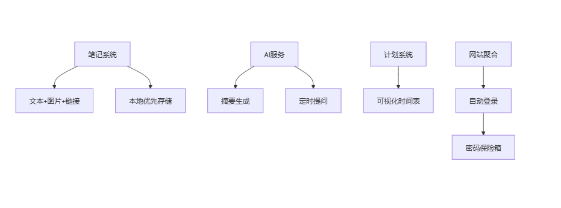

# cognilearn-hub
### 项目简介:
快来认识一下超酷的 “Cognilearn - Hub” 项目！
个人项目，一个创新性的综合性学习平台项目，打造一个高效、便捷且个性化的学习笔记，助力学习者轻松实现知识的获取与技能的提升。
后续：小程序，app开发
### 项目用户人数估计:
最大不过1000人，小而优，生命周期：生命不息

### 项目资源管理:
一台云服务器（2C4G，后续升级至4C8G）
一个域名（cognilearn-hub的域名）<1元首年，35一年>
第三方服务：邮件服务，消息推送，文件存储
AI 功能：开源大模型取代调用商业大模型
数据监控：使用免费的日志监控工具
HTTPS = HTTP + SSL（Secure Sockets Layer）/TLS（Transport Layer Security）

### 初步规范开发流程：
项目用测试驱动开发与领域驱动开发和CI/CD，首先从master分支开分支到feature分支，在对应领域先写单元测试类（覆盖正常使用场景、边界条件以及异常情况），然后做功能开发，功能开发完成，在测试分支做模块间集成测试,与外部系统集成测试，基本安全漏洞检查，在uat分支类生产环境做集成与测压（省略），最后合并到master分支，用Jenkins做构建部署。

核心业务：

# 再过滤总结
一、核心功能优先级调整
笔记管理系统（优先开发）
基础功能：实现文本、图片、链接的增删改查，支持 Markdown 编辑（采用 SimpleMDE），使用阿里云 OSS 存储图片和附件。
优化功能：启用本地优先存储（IndexedDB），保障离线使用与数据安全；数据库选用 MongoDB，便于存储非结构化数据，支持后续扩展。
AI 学习助手
基础功能：基于开源大模型（如 LLaMA - 2 - 7B - Chat）搭建 RAG（检索增强生成）系统，通过向量数据库（如 Chroma）存储笔记和学习资料，实现 AI 摘要与提问功能。
优化功能：引入 MCP（多智能体协作），创建多个 AI 角色（如 “总结助手”“复习规划师”），实现自动摘要、按记忆曲线定时发消息提问回顾功能；集成 SendGrid 和微信公众号接口，实现邮件 / 微信提醒。
学习计划表
基础功能：开发可视化日历式计划表，支持小时粒度规划与完成度热力图展示。
优化功能：结合 AI 生成个性化学习计划，通过消息队列（RabbitMQ）实现智能提醒推送。
学习网站聚合
基础功能：利用 Selenium 或 Playwright 实现学习网站自动登录，创建自定义资源看板。
优化功能：基于爬虫获取热点数据，使用 Redis 缓存排行榜；结合 NLTK 实现智能内容过滤。
用户认证体系
基础功能：采用 BCrypt 加密、JWT 无状态认证，完成账号密码登录与注册验证。
优化功能：开放 QQ、Google 第三方登录，降低新用户使用门槛；仅在敏感操作（如支付）时启用短信验证，降低成本。
二、数据安全强化方案
数据存储安全
对笔记等敏感数据进行端到端加密，用户生成密钥并本地保存，服务器仅存储密文。
数据库采用 SSL/TLS 加密传输，定期备份数据至冷存储（如阿里云 OSS 低频访问存储）。
传输安全
强制使用 HTTPS 协议，配置 HSTS（HTTP 严格传输安全），防止中间人攻击。
权限管理
基于 RBAC（角色 - 基于访问控制）设计权限系统，核心用户拥有最高权限，普通用户仅能访问个人数据。
对 AI 接口设置严格的调用频率限制，防止恶意请求耗尽资源。

第一阶段：用户认证体系基础功能与笔记管理系统基础功能
用户认证体系基础功能：
这是整个平台的基石，只有用户成功认证登录后，才能使用平台的其他功能。先实现账号密码登录（BCrypt 加密）、注册验证流程和 JWT 无状态认证，确保用户身份的安全性和唯一性。这部分功能的开发可以为后续功能的实现提供用户身份验证的基础，比如在其他功能模块中，需要根据用户身份来进行数据的权限控制等。
实现后可以进行初步的安全测试，如检查密码加密的强度、注册流程的合理性等，及时发现并修复潜在的安全漏洞。
笔记管理系统基础功能：
作为核心业务之一，笔记管理是用户使用平台的重要部分。先完成文本笔记的 CRUD 操作和无限层级模块化组织，满足用户对笔记的基本管理需求。
此功能与其他模块（如 AI 学习助手）存在数据交互，AI 学习助手的总结和提问功能可能需要基于用户的笔记内容，所以先实现可以为后续功能的集成提供数据支持。
同时，在开发过程中可以确定数据库的基本结构和存储方式，为其他功能模块的数据库设计提供参考。
第二阶段：AI 学习助手基础功能、学习计划表基础功能和学习网站聚合基础功能
AI 学习助手基础功能：
基于已经搭建好的 RAG 系统框架（在第一阶段完成），实现 AI 每日笔记总结与智能提问、学习内容自动摘要生成功能。这些功能可以直接为用户提供价值，帮助用户更好地理解和管理学习内容。
与笔记管理系统紧密相关，能够利用已有的笔记数据进行分析和处理，进一步完善平台的学习辅助功能。
学习计划表基础功能：
开发可视化日历式计划表（小时粒度）和完成度热力图，让用户能够直观地规划和跟踪自己的学习进度。这是学习平台的重要功能之一，能够提高用户的学习效率和自律性。
可以与 AI 学习助手的功能相结合，例如 AI 可以根据用户的学习计划和笔记内容，提供更个性化的学习建议。
学习网站聚合基础功能：
实现主流学习平台统一认证和自定义资源看板，方便用户集中管理和访问不同学习网站的资源。同时，开发凭据保险箱功能，安全存储和管理用户的登录凭据，实现 “一键自动登录”，提升用户体验。
此功能可以吸引用户使用平台，增加平台的实用性和便利性，与其他功能模块相互补充，共同构成一个完整的学习平台。
第三阶段：各模块优化功能与数据安全强化
各模块优化功能：
在完成基础功能的基础上，逐步实现各模块的优化功能。如 AI 学习助手的 AI 服务降级、邮件 / 微信定时复习提醒、基于艾宾浩斯记忆曲线的复习调度算法；学习计划表的智能提醒推送系统、计划完成率分析报告；笔记管理系统的多媒体笔记支持、Markdown 编辑器集成、本地优先存储策略；学习网站聚合的热点内容排行榜、智能内容过滤引擎；用户认证体系的多通道认证、密码强度实时检测、JWT 单点登录方案；用户数据看板的个性化成就系统、社区排行榜功能等。
这些优化功能可以进一步提升平台的性能和用户体验，满足用户更高级的需求，增加平台的竞争力。
数据安全强化：
对笔记等敏感数据进行端到端加密，数据库采用 SSL/TLS 加密传输，定期备份数据至冷存储，强制使用 HTTPS 协议，配置 HSTS，基于 RBAC 设计权限系统，对 AI 接口设置调用频率限制等。
随着平台功能的逐渐完善和用户数据的增加，数据安全变得尤为重要。在这个阶段进行全面的数据安全强化，可以确保用户数据的安全性和隐私性，增强用户对平台的信任。
第四阶段：后台监控中心功能与整体测试优化
后台监控中心功能：
实现用户行为埋点分析、接口健康度监控、仅保留错误日志（Sentry 免费版），以及实时数据流水线、用 Prometheus + Telegram Bot 实现低成本告警、智能异常告警（Prometheus + Alertmanager）等优化功能。
后台监控可以帮助及时发现平台运行过程中出现的问题，如性能瓶颈、接口异常等，为平台的稳定运行提供保障。
整体测试优化：
进行全面的安全测试（OWASP ZAP 扫描、渗透测试），修复潜在漏洞；部署至 UAT 环境进行压力测试与用户验收，根据反馈优化性能与功能。
通过整体测试和优化，可以确保平台在正式上线前达到较高的质量标准，提供良好的用户体验。

三、开发阶段建议
第一阶段（1 - 2 周）
完成用户认证体系基础功能开发与笔记管理系统基础功能开发。
搭建 RAG 系统框架，确定向量数据库选型与数据索引方式。
第二阶段（2 - 3 周）
实现 AI 学习助手基础功能，完成学习计划表和学习网站聚合的基础开发。
接入邮件 / 微信提醒功能，完成 MCP 多智能体协作的初步设计。
第三阶段（1 - 2 周）
完成各模块优化功能开发，重点实现 AI 智能计划、数据安全加固与第三方登录。
进行全面的安全测试（OWASP ZAP 扫描、渗透测试），修复潜在漏洞。
第四阶段（1 周）
部署至 UAT 环境进行压力测试与用户验收，根据反馈优化性能与功能。
配置 Prometheus + Telegram Bot 实现低成本告警，监控系统关键指标。

# cognilearn - hub 开发规划

## 功能模块分解

### 1. AI 学习助手（RAG,MCP,A2A）
#### 基础功能
- [ ] AI 每日笔记总结与智能提问  
- [ ] 学习内容自动摘要生成
  
#### 优化方向
- [ ] AI服务降级
- [ ] 邮件 / 微信定时复习提醒：使用邮件服务提供商（如 SendGrid）和微信公众号接口实现提醒功能。  
- [ ] 基于艾宾浩斯记忆曲线的复习调度算法：采用开源的记忆曲线算法库，结合用户的学习记录动态调整复习时间。

### 2. 学习计划表
#### 基础功能
- [ ] 可视化日历式计划表（小时粒度）  
- [ ] 完成度热力图（绿色深度表示）

#### 优化方向
- [ ] 智能提醒推送系统：利用消息队列（如 RabbitMQ）实现提醒消息的异步推送。  
- [ ] 计划完成率分析报告：使用数据分析工具（如 Python 的 Pandas 库）生成报告。

### 3. 笔记管理系统
#### 基础功能
- [ ] 文本笔记 CRUD 操作  
- [ ] 无限层级模块化组织

#### 优化方向
- [ ] 多媒体笔记支持（图片 / 附件）：使用文件存储服务（如 阿里云 OSS）存储图片和附件。  
- [ ] Markdown 编辑器集成：引入开源的 Markdown 编辑器（如 SimpleMDE）。  
- [ ] 本地优先存储策略：使用浏览器的本地存储（如 IndexedDB）实现数据的本地存储。  
- [ ] 分布式文档数据库选型（MongoDB/Couchbase）：根据项目规模和性能需求选择合适的数据库。

### 4. 学习网站聚合
#### 基础功能
- [ ] 主流学习平台统一认证  
- [ ] 自定义资源看板
- [ ] 凭据保险箱（Credential Vault）是一种安全存储和管理敏感登录凭据（如账号密码、API密钥等）的加密存储系统。在您的学习平台项目中，它主要用于安全地保存用户在各个学习网站（如Coursera、edX等）的登录信息，实现"一键自动登录"功能，同时确保这些敏感数据不会被泄露。
#### 优化方向
- [ ] 热点内容排行榜：通过爬虫技术获取学习网站的热点数据，使用 Redis 缓存排行榜数据。  
- [ ] 智能内容过滤引擎：使用自然语言处理技术（如 NLTK）实现内容过滤。

### 5. 用户认证体系
#### 基础功能
- [ ] 账号密码登录（BCrypt 加密）  BCrypt慢加载（内置盐值），防止穷举法和彩虹表攻击
- [ ] 注册验证流程
- [ ] JWT无状态认证

#### 优化方向
- [ ] 多通道认证（短信 / 社交账号）：QQ+Google登录（零成本），短信验证仅用于敏感操作（如支付），使用第三方短信服务提供商（如 阿里云短信服务）和社交平台的开放 API 实现。  
- [ ] 密码强度实时检测：使用正则表达式实现密码强度检测。  
- [ ] JWT 单点登录方案：使用 JSON Web Token（JWT）实现单点登录。

### 6. 用户数据看板
#### 基础功能
- [ ] 学习数据可视化统计

#### 优化方向
- [ ] 个性化成就系统：根据用户的学习行为和成就规则生成个性化成就。  
- [ ] 社区排行榜功能：使用数据库的排序功能实现排行榜。

### 7. 后台监控中心
#### 基础功能
- [ ] 用户行为埋点分析  
- [ ] 接口健康度监控
- [ ] 仅保留错误日志（Sentry免费版）
#### 优化方向
- [ ] 实时数据流水线：使用流式处理框架（如 Apache Kafka）实现数据的实时处理。  
- [ ] 用Prometheus + Telegram Bot实现低成本告警
- [ ] 智能异常告警（Prometheus + Alertmanager）：使用 Prometheus 监控系统指标，Alertmanager 发送告警信息。  